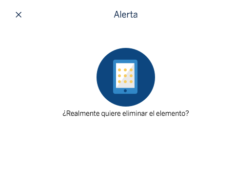

# cells-alert-box

[](http://bbva-files.s3.amazonaws.com/cells/bbva-catalog/index.html)

[Demo of component in Cells Catalog](http://bbva-files.s3.amazonaws.com/cells/bbva-catalog/index.html#/elements/cells-alert-box)

`cells-alert-box` is a wrapper component that using cells-bottom-modal creates a typical confirmation modal. It just includes a header and Accept/Cancel buttons. The 'body' of the modal will be handled by content

Example:
```html
<cells-alert-box
  disable-primary-button
  full-height
  opened
  title="cells-alert-box-title"
  accept-button="cells-alert-box-accept"
  cancel-button="cells-alert-box-cancel">
    <p> Do you want to continue with the process? </p>
  </cells-alert-box>
```

## Icons

Since this component uses icons, it will need an [iconset](https://bbva.cellsjs.com/guides/best-practices/cells-icons.html) in your project as an [application level dependency](https://bbva.cellsjs.com/guides/advanced-guides/application-level-dependencies.html).
In fact, this component uses an iconset in its demo.

## Styling

The following custom properties and mixins are available for styling:

### Custom Properties

| Custom Property      | Selector           | CSS Property | Value       |
| -------------------- | ------------------ | ------------ | ----------- |
| --cells-fontDefault  | :host              | font-family  |  sans-serif |
| --cells-text-size-16 | .subtitle          | font-size    |  1rem       |
| --cells-text-size-14 | .wrapper           | font-size    |  0.875rem   |
| --cells-text-size-14 | .content-container | font-size    |  0.875rem   |
| --cells-text-size-14 | ::slotted(*)       | font-size    |  0.875rem   |

### @apply

| Mixins                                    | Selector                            | Value |
| ----------------------------------------- | ----------------------------------- | ----- |
| --cells-alert-box-cells-bottom-modal-body | :host > --cells-bottom-modal-body:  | {}    |
| --cells-alert-box                         | :host                               | {}    |
| --cells-alert-box-modal                   | #modal                              | {}    |
| --cells-alert-box-subtitle                | .subtitle                           | {}    |
| --cells-alert-box-wrapper                 | .wrapper                            | {}    |
| --cells-alert-box-image-container         | .icon-container                     | {}    |
| --cells-alert-box-image                   | .icon-container img                 | {}    |
| --cells-alert-box-content-container       | .content-container                  | {}    |
| --cells-alert-box-slotted                 | ::slotted(*)                        | {}    |
| --cells-alert-box-button-container        | .buttons-container                  | {}    |
| --cells-alert-box-button                  | .buttons-container button           | {}    |
| --cells-alert-box-button-disabled         | .buttons-container button[disabled] | {}    |
| --cells-alert-box-button-info             | .buttons-container button span      | {}    |

