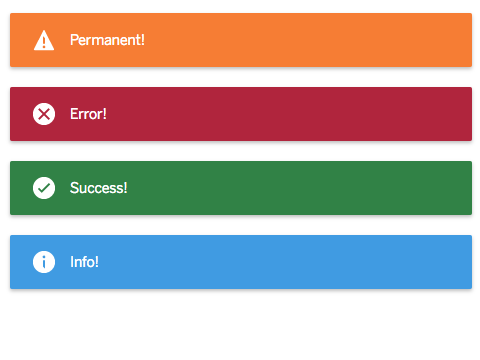

# cells-alert-manager

[](http://bbva-files.s3.amazonaws.com/cells/bbva-catalog/index.html)

[Demo of component in Cells Catalog](http://bbva-files.s3.amazonaws.com/cells/bbva-catalog/index.html#/elements/cells-alert-manager)

> Displays a single or multiple alerts

Example:
```html
<cells-alert-manager></cells-alert-manager>
document.querySelector('cells-alert-manager').showToast('An error!');
```

## Toast model

`showToast(model)` method accepts a `model` param that could be:
- an object
- a string
- an event

#### Objects

`model` should be:
```json
{
    "type": "(String) info|error|warning|success",
    "duration": "0|N - time in seconds",
    "message": "(String) To be displayed"
}
```

If `model.duration` is `0`, it will be permanent.

#### String

In case of being an string, default toast error will be displayed.

#### Event

In case of being an event, `event.detail` should contain either an string or an object.

## Styling

The following custom properties and mixins are available for styling:

| Custom property | Description     | Default        |
|:----------------|:----------------|:---------------|
| --cells-alert-manager  | Mixin applied to :host     | {}  |
| --cells-fontDefault  | Mixin applied to :host font-family    | sans-serif  |
| --cells-alert-manager-color | Front color applied to toast | #FFFFFF |
| --cells-alert-manager-inner-toast | Mixin applied to internal toast div | {} |
| --cells-alert-manager-info-toast | Background color applied to info toasts |  #49A5E6 |
| --cells-alert-manager-error-toast | Background color applied to error toasts | #B92A45 |
| --cells-alert-manager-success-toast | Background color applied to success toast | #388D4F |
| --cells-alert-manager-warning-toast | Background color applied to warning toasts | #F7893B |

## Icons

Since this component uses icons, it will need an [iconset](https://globaldevtools.bbva.com/bitbucket/projects/CS/repos/cellsjs-guides-resources/browse/docs/best-practices/cells-icons.md)
in your project as an [application level dependency](https://globaldevtools.bbva.com/bitbucket/projects/CS/repos/cellsjs-guides-resources/browse/docs/advanced-guides/advanced-guides/application-level-dependencies.md).
In fact, this component uses an iconset in its demo.

__icons__

By defining the `icons` property you could define your own set of icons to display.

#### Sample

```html
<link rel="import" href="../banking-icons/banking-icons.html"/>
<cells-alert-manager icons='{"error":"banking:B41", "success":"banking:G13", "info":"banking:M03", "warning":"banking:M01"}'></cells-alert-manager>
```

Default __icons__ are [coronita](https://bbva-files.s3.amazonaws.com/cells/bbva-catalog/index.html#/elements/cells-icons?active=cells-icons&view=demo:demo/index.html&v=1.7.0)

## Properties

| NAME | Type | Default | Description | Binding |
|:--- |:---:|:---:|:--- |:---:|
| duration | {`Number`} | 3 | Default toast duration, in seconds. This will be applied to all alerts. | IN |
| icons | {`Object`} | `{"error": coronita:error, "success": coronita:correct, "warning": coronita:alert, "info": coronita:info}` | Icons to be displayed with each kind of alert | IN |

## Methods

| NAME | Arguments | Returns | Description |
|:--- |:---:|:---:|:--- |
| clear() | | | Clears whole alerts array |
| showToast(toast) | toast {`*`} To be displayed | | Adds an alert to be displayed. |
