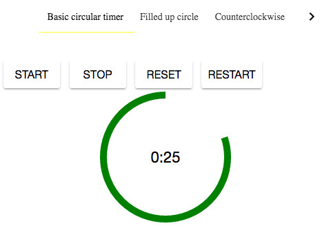

# cells-circular-timer

[](http://bbva-files.s3.amazonaws.com/cells/bbva-catalog/index.html)
[Demo of component in Cells Catalog](http://bbva-files.s3.amazonaws.com/cells/bbva-catalog/index.html#/elements/cells-circular-timer)

Shows a countdown in the 0:00 format and a circle that changes with time.
Fires an event after a specified number of milliseconds.

* **disabledAnimation**: Disable svg counter animation. Default: `false`
* **running**: (Readonly) Determines whether the timer is running.
* **timeout**: Time in milliseconds for the countdown.
* **timeWarning**: Time in milliseconds for the event that warns that the time is running out. Default: `10000` ms
* **off**: Determines whether the countdown starts automatically. Default: `false`
* **fillUp**: Determines if the circle goes from full to empty or the other way around. Default: `false`
* **counterClockwise**: Determines if the circle changes in the opposite direction of the hands on a clock. Default: `false`

Example with control turned off:
```html
<cells-circular-timer timeout="30000" time-warning="10000" off></cells-circular-timer>
```

Example that starts automatically:
```html
<cells-circular-timer timeout="30000" time-warning="10000"></cells-circular-timer>
```

Example that fills up the circle:
```html
<cells-circular-timer timeout="30000" time-warning="10000" fill-up></cells-circular-timer>
```

Example that changes the circle in the opposite direction of the hands on a clock:
```html
<cells-circular-timer timeout="30000" time-warning="10000" counter-clockwise></cells-circular-timer>
```
Example that disable the circle animation:
```html
<cells-circular-timer timeout="30000" time-warning="10000" counter-clockwise disabled-animation></cells-circular-timer>
```

## Events

* **on-timeout**: Fired when time expires.
* **on-warning**: Fired when time is about to expire.


## Styling

The following custom properties and mixins are available for styling:

| Custom property | Description     | Default        |
|:----------------|:----------------|:--------------:|
| --cells-circular-timer  | empty mixin     | {}             |
| --cells-circular-timer-wrapper  | mixin for the wrapper     | {}             |
| --cells-circular-timer-svg  | Mixin for the svg element     | {}             |
| --cells-circular-timer-circle  | Mixin for the svg circle     | {}             |
| --cells-circular-timer-count  | Mixin for the text that shows the count   | {}             |
| --cells-circular-timer-count-text-color  | Color of the text that shows the count   | #000 |
| --cells-circular-timer-circle-stroke-width  | Width of the circle   | 5px             |
| --cells-circular-timer-circle-stroke-color  | Color of the circle   | green             |
| --cells-circular-timer-time-running-out-circle-stroke-color  | Color of the circle when time is running out   | blue             |
