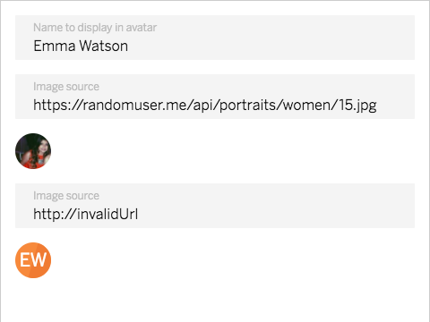

# cells-contact-avatar

[](http://bbva-files.s3.amazonaws.com/cells/bbva-catalog/index.html)

[Demo of component in Cells Catalog](http://bbva-files.s3.amazonaws.com/cells/bbva-catalog/index.html#/elements/cells-contact-avatar)

`<cells-contact-avatar>` Displays a ball with a letter or an image as avatar.

Example:
```html
 <cells-contact-avatar
    src="assets/avatar.png"
    alt="My alternative text">
 </cells-contact-avatar>
```

## Styling

The following custom properties and mixins are available for styling:

| Custom property | Description     | Default        |
|:----------------|:----------------|:--------------:|
| --cells-contact-avatar | empty mixin  | {} |
| --cells-contact-avatar-image | empty mixin  | {} |
| --cells-contact-avatar-initial | empty mixin  | {} |
| --cells-contact-avatar-initial-bg | Background of initial avatar  | var(--bbva-orange, #F7893B) |
| --cells-contact-avatar-initial-content | empty mixin  | {} |
| --cells-contact-avatar-content-color | Color of content  | var(--bbva-white, #fff) |
| --cells-contact-avatar-initial-color-bg | Background color of initial avatar  | #eb722c |
| --cells-contact-avatar-initial-before | empty mixin  | {} |
