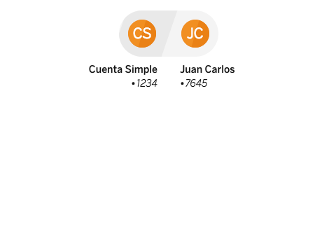

# cells-from-to

[](http://bbva-files.s3.amazonaws.com/cells/bbva-catalog/index.html)

[Demo of component in Cells Catalog](http://bbva-files.s3.amazonaws.com/cells/bbva-catalog/index.html#/elements/cells-from-to)

<cells-from-to> Is a component to show the two first initials from user name or user name and surname or avatar image if it is available and origin and destionation data from accounts numbers or user names.

Example:
```html
<cells-from-to
  origin="Cuenta Simple"
  origin-number="1234"
  destination="Juan Carlos"
  destination-number="7645">
</cells-from-to>
```

## Styling

The following custom properties and mixins are available for styling:

| Custom property | Description     | Default        |
|:----------------|:----------------|:--------------:|
| --cells-from-to | empty mixin | {} |
| --cells-from-to-list | empty mixin | {} |
| --cells-from-to-list-item | empty mixin | {} |
| --cells-from-to-list-item-odd | empty mixin | {} |
| --cells-from-to-list-item-odd-after | empty mixin | {} |
| --cells-from-to-initial | empty mixin | {} |
| --cells-from-to-initial-before | empty mixin | {} |
| --cells-from-to-initial-content | empty mixin | {} |
| --cells-from-to-info | empty mixin | {} |
| --cells-from-to-item | empty mixin | {} |
| --cells-from-to-item-even | empty mixin | {} |
| --cells-from-to-item-odd | empty mixin | {} |
| --cells-from-to-info-name | empty mixin | {} |
| --cells-from-to-molecule-mask-number | empty mixin | {} |
| --cells-from-to-list-bg | background color | var(--bbva-100, #F4F4F4) |
| --cells-from-to-list-item-odd-bg | background color | var(--bbva-200, #E9E9E9) |
| --cells-from-to-inital-bg | background color  | var(--bbva-orage, #F7893B)  |
| --cells-from-to-list-inital-before | background color | var(--bbva-dark-orange, #d8732c) |
| --cells-from-to-intial-content-color | color | var(--bbva-white, #fff) |
| --cells-from-to-list-info-name-color | color | var(--bbva-600, #121212) |
