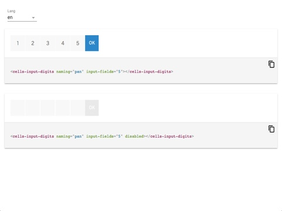

# cells-input-digits

[](http://bbva-files.s3.amazonaws.com/cells/bbva-catalog/index.html)

[Demo of component in Cells Catalog](http://bbva-files.s3.amazonaws.com/cells/bbva-catalog/index.html#/elements/cells-input-digits)

`<cells-input-digits>` is a digits-form composed by `<cells-molecule-input>` elements.

Example with minimal configuration:

```html
<cells-input-digits
  naming="cool" input-fields="5"></cells-input-digits>
```

Fix the responsiveness for wider screens:

By giving a `max-width` to the component once you know how many fields it will have.
The `max-width` being the result of multiplying the max-width of each cell by number of fields.

```html
<style>
cells-input-digits {
  max-width: 7 * 50px;
}
</style>
<cells-input-digits naming="forWideScreen" input-fields="7"></cells-input-digits>
```

## Styling

The following custom properties and mixins are available for styling:

| Custom property | Description     | Default        |
|:----------------|:----------------|:--------------:|
| --cells-input-digits  | empty mixin     | {}             |
| --cells-input-digits-inputs  | empty mixin for rendered all inputs    | {}             |
| --cells-input-digits-wider      | empty mixin for :host(.wider) | {}  |
| --cells-input-digits-input      | empty mixin for each input | {}  |
| --cells-input-digits-input-last      | empty mixin for the last input | {}  |
| --cells-input-digits-input-disabled      | empty mixin for disabled inputs | {}  |
| --cells-input-digits-input-disabled-last | empty mixin for the last disabled input | {}  |
| --cells-input-digits-button | empty mixin for the submit button | {}  |
| --cells-input-digits-button-color | background color for button  | #2A86CA |
| --cells-input-digits-button-disabled-color | background color for disabled button  | #E9E9E9 |
| --cells-input-digits-inputs-disabled-bg-color | background color for disabled inputs  | #fff |
