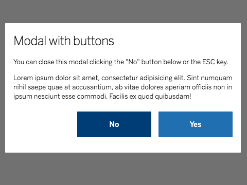

# cells-middle-modal


[](http://bbva-files.s3.amazonaws.com/cells/bbva-catalog/index.html)

[Demo of component in Cells Catalog](http://bbva-files.s3.amazonaws.com/cells/bbva-catalog/index.html#/elements/cells-middle-modal)

`cells-middle-modal` shows a modal window aligned at the center of the screen.

## Try it

__Simple example__
```html
<cells-middle-modal id='modal-example' aria-label="Lorem ipsum">
    Lorem-ipsum
</cells-middle-modal>
```

__Complex example__
```html
<cells-middle-modal id='modal-example' aria-labelledby="modal-aria-label" click-on-close close-icon='coronita:close' focus-target="btn1">
    <div class="header" id="modal-aria-label"> My Header </div>
    <div class="body"> My Body </div>
    <div class="buttons">
        <button id="btn1"/>
        <button id="btn2"/>
    </div>
</cells-middle-modal>
```

You can use helper classes inside the component content:
 - __header__  sets default color and size for headers
 - __body__ sets default padding and margin for bodies
 - __buttons__ aligns horizontally your buttons

## Customize it

__Close on click in the overlay__
Use the property `close-on-click` to allow the modal to hide itself when the overlay is clicked

__Close icon__
Use property `close-icon` to provide a close icon at the top-right of the modal

__Header with background color__
Use property `main-header-text` to show a text as a header with colored background on the top of the modal

__Place custom content before the dialog box__
Use the slot `pre-dialog`. Example:

```html
<cells-middle-modal>
  <button slot="pre-dialog">Close</button>
</cells-middle-modal>
```

## Handle it

Set the boolean property `open` to true or false to open or close the modal.

Buttons inside light DOM with attribute `data-action="hide"` also close the modal by setting `open` to false.

```html
<cells-middle-modal>
  <button data-action="hide">Close</button>
</cells-middle-modal>
```

## Accessibility

The component applies a "dialog" aria role to the modal by default. You can pass a `role` attribute to change it to "alertdialog" if you need it.

You __must__ provide either an `aria-label` or `aria-labelledby` attribute to the component, as well as an `aria-describedby` attribute if necessary.

An open dialog can be closed using ESC key.

Also, an open dialog traps focus inside it. `focus-target` attribute should be used to pass the Id of the modal content element which should receive focus when the modal is opened. If `close-icon` is provided and `focus-target` is not, focus will be set to the close icon.

When using `main-header-text` attribute, its text will receive a `role=heading` attribute and an `aria-level=1` attribute. You can set a different aria-level using `heading-level` attribute and passing a number to it. In case you don't want that text to behave as a heading, role and aria-level will be entirely removed passing a 0 value to `heading-level`.

Examples of accessible dialogs:

__Accessible dialog modal__
```html
<cells-middle-modal aria-labelledby="aria-text" close-icon="coronita:GM02" main-header-text="Help" heading-level="2">
    <div class="header" id="aria-text">Action result</div>
    <p class="body">Thank you for your message. You'll receive a confirmation in your mail address soon.</p>
</cells-middle-modal>
```

__Accessible alertdialog modal__
```html
<cells-middle-modal role="alertdialog" aria-label="Action confirmation" aria-describedby="aria-text" focus-target="btn-no">
    <p class="body" id="aria-text">Are you sure you want to execute this action?</p>
    <div class="buttons">
        <ul>
            <li><button type='button' id="btn-no">No</button></li>
            <li><button type='button'>Yes</button></li>
        </ul>
    </div>
</cells-middle-modal>
```

## Icons

Since this component uses icons, it will need an [iconset](https://bbva.cellsjs.com/guides/best-practices/cells-icons.html) in your project as an [application level dependency](https://bbva.cellsjs.com/guides/advanced-guides/application-level-dependencies.html). In fact, this component uses an iconset in its demo.

## Styling

The following custom properties and mixins are available for styling:

### Custom Properties
| Custom Property                                                   | Selector                                                    | CSS Property     | Value                                                             |
| ----------------------------------------------------------------- | ----------------------------------------------------------- | ---------------- | ----------------------------------------------------------------- |
| --cells-fontDefault                                               | :host                                                       | font-family      |  sans-serif                                                       |
| --cells-middle-modal-md-modal-max-width                           | .md-modal                                                   | max-width        |  71.25rem                                                         |
| --cells-middle-modal-md-modal-min-width                           | .md-modal                                                   | min-width        |  18.75rem                                                         |
| --cells-middle-modal-md-overlay-background-color                  | .md-overlay                                                 | background-color |   #121212 |
| --cells-middle-modal-md-overlay-opacity                           | :host([open]) > .md-overlay                                 | opacity          |  0.6                                                              |
| --cells-middle-modal-md-wrapper-background-color                  | .md-wrapper                                                 | background       |   #fff          |
| --cells-middle-modal-md-wrapper-color                             | .md-wrapper                                                 | color            |   #666          |
| --cells-middle-modal-md-wrapper-border-radius                     | .md-wrapper                                                 | border-radius    |  1px                                                              |
| --cells-middle-modal-md-content-padding                           | .md-content                                                 | padding          |  1.25em 1em 1.875em                                               |
| --cells-middle-modal-md-content__btn-close-horizontal             | .md-content__btn-close                                      | left             |  1em                                                              |
| --cells-middle-modal-md-content__btn-close-top                    | .md-content__btn-close                                      | top              |  1.25em                                                           |
| --cells-middle-modal-close-icon-color                             | .md-content__btn-close .icon-close                          | color            |   #2a86ca |
| --cells-middle-modal-with-close-md-content-padding                | :host([close-icon]) .md-content                             | padding          |  4.75em 1em 1.875em                                               |
| --cells-middle-modal-main-header-color                            | .main-header-text .main-header                              | color            |   #fff          |
| --cells-middle-modal-main-header-background-color                 | .main-header-text .main-header                              | background-color |   #d8be75 |
| --cells-middle-modal-main-header-text-size                        | .main-header-text .main-header #heading                     | font-size        |  1.5rem                                                           |
| --cells-middle-modal-main-header-md-content__btn-close-horizontal | .main-header-text .md-content__btn-close                    | right            |  1.5em                                                            |
| --cells-middle-modal-main-header-md-content__btn-close-top        | .main-header-text .md-content__btn-close                    | top              |  1.5em                                                            |
| --cells-middle-modal-main-header-text-close-icon-color            | .main-header-text .md-content__btn-close .icon-close        | color            |   #fff          |
| --cells-middle-modal-content-header-color                         | .main-header-text .md-content ::slotted(.header)            | color            |   #121212 |
| --cells-middle-modal-content-header-text-size                     | .main-header-text .md-content ::slotted(.header)            | font-size        |  1.5rem                                                           |
| --cells-middle-modal-content-body-color                           | .main-header-text .md-content ::slotted(.body)              | color            |   #121212 |
| --cells-middle-modal-content-body-text-size                       | .main-header-text .md-content ::slotted(.body)              | font-size        |  0.8125rem                                                        |
| --cells-middle-modal-content-body-line-height                     | .main-header-text .md-content ::slotted(.body)              | line-height      |  1.125rem                                                         |
| --cells-middle-modal-desktop-md-content-max-width                 | @media (min-width: 768px) > .md-content                     | max-width        |  34.375rem                                                        |
| --cells-middle-modal-md-content-padding                           | @media (min-width: 768px) > .md-content                     | padding          |  5.625em 0 5em                                                    |
| --cells-middle-modal-md-content__btn-close-horizontal             | @media (min-width: 768px) > .md-content__btn-close          | right            |  1.5625rem                                                        |
| --cells-middle-modal-md-content__btn-close-top                    | @media (min-width: 768px) > .md-content__btn-close          | top              |  1.5625rem                                                        |
| --cells-middle-modal-content-header-text-size                     | @media (min-width: 768px) > .md-content ::slotted(.header)  | font-size        |  2.25rem                                                          |
| --cells-middle-modal-content-header-color                         | @media (min-width: 768px) > .md-content ::slotted(.body)    | color            |   #666          |
| --cells-middle-modal-content-body-text-size                       | @media (min-width: 768px) > .md-content ::slotted(.body)    | font-size        |  0.9375rem                                                        |
| --cells-middle-modal-content-body-line-height                     | @media (min-width: 768px) > .md-content ::slotted(.body)    | line-height      |  1.4375rem                                                        |
| --cells-middle-modal-md-content-padding                           | @media (min-width: 768px) > :host([close-icon]) .md-content | padding          |  5.625em 0 5em                                                    |
### @apply
| Mixins                                                       | Selector                                                    | Value |
| ------------------------------------------------------------ | ----------------------------------------------------------- | ----- |
| --cells-middle-modal                                         | :host                                                       | {}    |
| --cells-middle-modal-md-modal                                | .md-modal                                                   | {}    |
| --cells-middle-modal-open                                    | :host([open]) > .md-modal                                   | {}    |
| --cells-middle-modal-property-open                           | :host([open])                                               | {}    |
| --cells-middle-modal-md-overlay                              | .md-overlay                                                 | {}    |
| --cells-middle-modal-md-overlay-open                         | :host([open]) > .md-overlay                                 | {}    |
| --cells-middle-modal-md-wrapper                              | .md-wrapper                                                 | {}    |
| --cells-middle-modal-md-content                              | .md-content                                                 | {}    |
| --cells-middle-modal-md-content__btn-close                   | .md-content__btn-close                                      | {}    |
| --cells-middle-modal-md-content--icon-close                  | .md-content__btn-close .icon-close                          | {}    |
| --cells-middle-modal-with-close-md-content                   | :host([close-icon]) .md-content                             | {}    |
| --cells-middle-modal-main-header                             | .main-header-text .main-header                              | {}    |
| --cells-middle-modal-main-header-heading                     | .main-header-text .main-header #heading                     | {}    |
| --cells-middle-modal-main-header-with-close-icon             | .main-header-text.with-close-icon .main-header              | {}    |
| --cells-middle-modal-main-header-text-md-content             | .main-header-text .md-content                               | {}    |
| --cells-middle-modal-main-header-text-md-content__btn-close  | .main-header-text .md-content__btn-close                    | {}    |
| --cells-middle-modal-main-header-text-md-content--icon-close | .main-header-text .md-content__btn-close .icon-close        | {}    |
| --cells-middle-modal-md-content--header                      | .main-header-text .md-content ::slotted(.header)            | {}    |
| --cells-middle-modal-md-content--body                        | .main-header-text .md-content ::slotted(.body)              | {}    |
| --cells-middle-modal-md-content--buttons                     | .main-header-text .md-content ::slotted(.buttons)           | {}    |
| --cells-middle-modal-md-effect                               | .md-effect .md-wrapper                                      | {}    |
| --cells-middle-modal-md-effect--open                         | :host([open]) .md-effect .md-wrapper                        | {}    |
| --cells-middle-modal-desktop-md-content                      | @media (min-width: 768px) > .md-content                     | {}    |
| --cells-middle-modal-desktop-md-content__btn-close           | @media (min-width: 768px) > .md-content__btn-close          | {}    |
| --cells-middle-modal-desktop-md-content--header              | @media (min-width: 768px) > .md-content ::slotted(.header)  | {}    |
| --cells-middle-modal-desktop-md-content--body                | @media (min-width: 768px) > .md-content ::slotted(.body)    | {}    |
| --cells-middle-modal-desktop-md-content--buttons             | @media (min-width: 768px) > .md-content ::slotted(.buttons) | {}    |
| --cells-middle-modal-desktop-with-close-md-content           | @media (min-width: 768px) > :host([close-icon]) .md-content | {}    |
