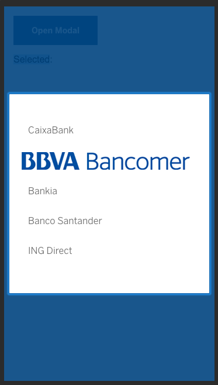

# cells-modal-selector

This component shows a list of options in a full screen view. It accepts texts and images, but only one of them per row.
Each row is an object and it contains at least two required properties: "id" and "name".
If the row shows an image then is needed to include another property called "image" with the image path.


This an example of text row object with the minimum data:
```json
  {
    id: '002',
    name: 'Bankia'
  }
```

This an example of image row object with the minimum data:
```json
  {
    id: '001',
    name: 'BBVA Bancomer',
    image: 'https://www.bancomer.com/fbin/logo_bancomer_tablet_opt_tcm1344-607500.png'
  }
```

This is an example of instantiation:
```html
 <cells-modal-selector id="el"
    opened="{{opened}}"
    items="[[listObjs]]"
    item-selected="{{itemSelected}}"
    icon="coronita:unfold">
  </cells-modal-selector>
```
Where "opened" is a boolean that indicates if the selector is opened. Items is the list of rows and item-selected is the current item selected.

"icon" property is used to show the check icon when a row is selected.
```

## Styling

The following custom properties and mixins are available for styling:

| Custom property                                             | Description                       | Default                     |
|:------------------------------------------------------------|:----------------------------------|:----------------------------|
| --cells-modal-selector                                      | empty mixin                       | {}                          |
| --cells-modal-selector-content                              | empty mixin                       | {}                          |
| --cells-modal-selector-content-label-hover                  | empty mixin                       | {}                          |
| --cells-modal-selector-content-label-selected               | empty mixin                       | {}                          |
| --cells-modal-selector-icon                                 | empty mixin                       | {}                          |
| --cells-modal-selector-label                                | empty mixin                       | {}                          |
| --cells-modal-selector-img-hover-background-color           | background color                  | --bbva-core-blue (#004481)  |
| --cells-modal-selector-img-hover                            | empty mixin                       | {}                          |
| --cells-modal-selector-img                                  | empty mixin                       | {}                          |
| --cells-modal-selector-list                                 | empty mixin                       | {}                          |
| --cells-modal-selector-check-icon                           | empty mixin                       | {}                          |