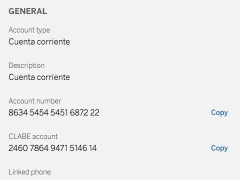

# cells-product-more-info


[Demo of component in Cells Catalog](https://bbva-ether-cellscatalogs.appspot.com/?view=demo#/component/cells-product-more-info)

shows more information about a product, such as general information, interveners and conditions or limits. The info may show masked, so the button will trigger an event to get the info unmasked.

Example:

```html
    <cells-product-more-info
      product="[[product]]"
      local-currency="EUR"
      date-format="DD MM YYYY">
    </cells-product-more-info>
```
## Data Model
```json
[{
    "title": "cells-product-more-info-general",
    "items": [{
        "key": "cells-product-more-info-alias",
        "value": "Credit Card."
      },
      {
        "key": "cells-product-more-info-account-number",
        "value": "4940 190360",
        "label": true
      },
      {
        "key": "cells-product-more-info-account-number",
        "value": "8649 294722",
        "label": true,
        "textInfo": "cells-product-more-info-account-cci-info",
        "iconInfo": "coronita:info"
      }
    ]
  },
  {
    "title": "cells-product-more-info-conditions",
    "items": [{
      "key": "Annual Card Maintenance Fee",
      "isAmount": true,
      "value": {
        "amount": 30,
        "currency": "EUR"
      }
    }]
  }
]
```

## Styling

The following custom properties and mixins are available for styling:

### Custom Properties
| Custom Property                                   | Selector                                      | CSS Property            | Value               |
| ------------------------------------------------- | --------------------------------------------- | ----------------------- | ------------------- |
| --cells-product-more-info-bg-color                | :host                                         | background-color        | --bbva-100          |
| --cells-fontDefault                               | :host                                         | font-family             | `No fallback value` |
| --cells-product-more-info-dt-color                | .info-list .info-list-dd-info                 | color                   | --bbva-500          |
| --cells-text-size-14                              | .info-list .info-list-dd-info                 | font-size               | `No fallback value` |
| --cells-product-more-info-list-dd-info-icon-color | .info-list .info-list-dd-info cells-atom-icon | color                   | --bbva-light-blue   |
| --cells-product-more-info-amount-color            | cells-atom-amount                             | color                   | --bbva-600          |
| --cells-product-more-info-date-color              | cells-atom-date                               | --cells-atom-date-color | --bbva-600          |
| --cells-product-more-info-section-title-color     | .section-title                                | color                   | --bbva-500          |
| --cells-text-size-14                              | dl                                            | font-size               | `No fallback value` |
| --cells-product-more-info-dt-color                | dt                                            | color                   | --bbva-500          |
| --cells-product-more-info-dd-color                | dd                                            | color                   | --bbva-600          |
| --cells-text-size-16                              | dd                                            | font-size               | `No fallback value` |
### @apply
| Mixins                                       | Selector                                      | Value |
| -------------------------------------------- | --------------------------------------------- | ----- |
| --cells-product-more-info                    | :host                                         | {}    |
| --cells-product-more-info-content            | .content                                      | {}    |
| --cells-product-more-info-list               | .info-list                                    | {}    |
| --cells-fontDefaultLight                     | .info-list .info-list-dd-info                 | {}    |
| --cells-product-more-info-list-dd-info       | .info-list .info-list-dd-info                 | {}    |
| --cells-product-more-info-list-dd-info-text  | .info-list .info-list-dd-info p               | {}    |
| --cells-product-more-info-list-dd-info-icon  | .info-list .info-list-dd-info cells-atom-icon | {}    |
| --cells-product-more-info-amount             | cells-atom-amount                             | {}    |
| --cells-product-more-info-date               | cells-atom-date                               | {}    |
| --cells-product-more-info-button-label       | cells-st-button                               | {}    |
| --cells-product-more-info-button-label-focus | cells-st-button button:focus                  | {}    |
| --small-heading                              | .section-title                                | {}    |
| --tertiary-heading                           | .section-title                                | {}    |
| --cells-product-more-info-section-title      | .section-title                                | {}    |
| --cells-product-more-info-dl                 | dl                                            | {}    |
| --cells-fontDefaultLight                     | dt                                            | {}    |
| --cells-product-more-info-dt                 | dt                                            | {}    |
| --cells-fontDefaultNormal                    | dd                                            | {}    |
| --cells-product-more-info-dd                 | dd                                            | {}    |
| --cells-product-more-info-skeleton           | cells-skeleton-item                           | {}    |
| --cells-product-more-info-skeleton-skeleton  | cells-skeleton-item                           | {}    ||
