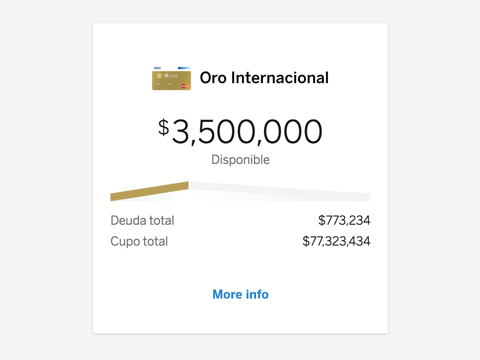

# cells-product-summary

[](http://bbva-files.s3.amazonaws.com/cells/bbva-catalog/index.html)

[Demo to component in Cells Catalog](http://bbva-files.s3.amazonaws.com/cells/bbva-catalog/index.html#/elements/cells-product-summary)


`<cells-product-summary>` displays product information with optional fields like product name, image, icon,
masked heading and different lists of key and values (typically monetary values or other information related to the product).

Check out the demo to see different configuration options.

`mainItems`, `optionalItems` and `additionalItems` expects the same format as [`<cells-key-values>`](http://bbva-files.s3.amazonaws.com/cells/bbva-catalog/index.html#/elements/cells-key-values).

Example:

```html
<cells-product-summary
  heading="Product Name"
  img-src="http://path-to/image.png"
  main-items='[{
    "key": "Available",
    "value": [{
      "amount": 30000,
      "currencyCode": "USD"
    }]
  }]'>
</cells-product-summary>
```

## component states

the component has four principal states, `loading`, `with data`, `with error` or `reset`.

### Loading

it is possible add this state to component with a declarative form, this states shows a spinner loading, so is possible add your own loading using `spinner` slot.

__declarative loading state__

```html
<cells-product-summary
  heading="Product Name"
  img-src="http://path-to/image.png"
  main-items='[{
    "key": "Available",
    "value": [{
      "amount": 30000,
      "currencyCode": "USD"
    }]
  }]'
  loading>
</cells-product-summary>
```

### With data

when the component is set with data, the loading component state and error component state is false. For set the component with data, it´s possible to use the function `onData()`.

__Using onData()__

```html
<cells-product-summary
  id="component0"
  heading="Product Name"
  img-src="http://path-to/image.png"
  main-items='[{
    "key": "Available",
    "value": [{
      "amount": 30000,
      "currencyCode": "USD"
    }]
  }]'>
</cells-product-summary>
```

```js
document.querySelector('#component0').onData()
```

### With error

if has an error, is possible to set the component with error state, using the funtion `onError()`. this show an error message. You can use your own error-message-component with `error` slot.

__Using onError()__

```html
<cells-product-summary
  id="component0"
  heading="Product Name"
  img-src="http://path-to/image.png"
  main-items='[{
    "key": "Available",
    "value": [{
      "amount": 30000,
      "currencyCode": "USD"
    }]
  }]'
  error-message="shows an error message"
  icon-error="my-icon-error"
  >
</cells-product-summary>
```

```js
document.querySelector('#component0').onError();
```

__Using an own error-component__

```html
<cells-product-summary
  id="component0"
  heading="Product Name"
  img-src="http://path-to/image.png"
  main-items='[{
    "key": "Available",
    "value": [{
      "amount": 30000,
      "currencyCode": "USD"
    }]
  }]'
  error-message="shows an error message"
  icon-error="my-icon-error"
  >
  <my-own-error-component slot="error"></my-own-error-component>
</cells-product-summary>
```

### reset

if the component has not setted data, is possible use the function `reset()`. using this function, the component is setted with loading `true`.

__Using reset__

```html
<cells-product-summary
  id="component0"
  heading="Product Name"
  img-src="http://path-to/image.png"
  main-items='[{
    "key": "Available",
    "value": [{
      "amount": 30000,
      "currencyCode": "USD"
    }]
  }]'
  >
</cells-product-summary>
```

```js
document.querySelector('#component0').reset({'value': false});
```

## Icons

Since this component uses icons, it will need an [iconset](https://bbva.cellsjs.com/guides/best-practices/cells-icons.html) in your project as an [application level dependency](https://bbva.cellsjs.com/guides/advanced-guides/application-level-dependencies.html). In fact, this component uses an iconset in its demo.

## Styling

The following custom properties and mixins are available for styling:

| Custom property                              | Description       | Default        |
|:---------------------------------------------|:------------------|:--------------:|
| --general-padding | padding applied to :host | 20px |
| --cells-fontDefault | font-family applied to :host | sans-serif |
| --cells-product-summary-padding | padding for cells-product-summary | var(--general-padding) |
| --cells-product-summary-border-radius | border-radius of the card | 2px |
| --cells-product-summary-after | Mixin applied to :host::after | {} |
| --cells-product-summary-background-color | Background color | var(--bbva-100, #F4F4F4) |
| --cells-product-summary-card-background-color | Background color for the card | var(--bbva-white, #fff) |
| --cells-product-summary | Mixin applied to :host | {} |
| --cells-product-summary-loading-background-color | background applied for content-loading | var(--bbva-white, #fff) |
| --cells-product-summary-loading | Mixin applied to content-loading | {} |
| --cells-product-summary-bottom-summary | Mixin applied to the container of the additional items and "More info" button | {} |
| --cells-product-summary-loading-background-color | Background color for the card | var(--bbva-white, #fff) |
| --cells-product-summary-header | Mixin applied to the header wrapper | {} |
| --cells-product-summary-header-img | Mixin applied to the header image | {} |
| --cells-product-summary-header-span | Mixin applied to the header text | {} |
| --cells-product-summary-header-icon | Mixin applied to the header icon | {} |
| --cells-product-summary-header-mask | Mixin applied to the header mask | {} |
| --cells-product-summary-header-mask-wrapper | Mixin applied to the header mask wrapper (See cells-molecule-mask) | {} |
| --cells-product-summary-header-mask-separator | Mixin applied to the header mask separator (See cells-molecule-mask) | {} |
| --cells-product-summary-more-info | Mixin applied to the "More info" button container | {} |
| --cells-product-summary-more-info-btn | Mixin applied to the "More info" button | {} |
| --cells-product-summary-content-progress-bar | Mixin applied to the progress bar wrapper | {} |
| --cells-product-summary-progress-bar-left-color | Color of the left bar of the default progress bar | #1464A5 |
| --cells-product-summary-progress-bar-right-color | Color of the right bar of the default progress bar | #F4F4F4 |
| --cells-product-summary-progress-bar-shadow-opacity | Shadow opacity of the default progress bar | 0.8 |
| --cells-product-summary-progress-bar-shadow-color | Shadow color of the default progress bar | #eee |
| --cells-product-summary-content-main-items | Mixin applied to the main list of items | {} |
| --cells-product-summary-content-main-items-not-first-child | Mixin applied to list items (`<li>`) in the main list but the first one | {} |
| --cells-product-summary-optional-items | Mixin applied to the optional list of items (second list) | {} |
| --cells-product-summary-optional-items-list | Mixin applied to the optional list items ul  | {} |
| --cells-product-summary-optional-items-list-item | Mixin applied to the optional list items li  | {} |
| --cells-product-summary-optional-items-list-item-inline | Mixin applied to the optional list items li inline | {} |
| --cells-product-summary-optional-items-list-item-not-first-key-value | Mixin applied to the optional list items li:not first key value  | {} |
| --cells-product-summary-optional-items-list-key-icon | Mixin applied to the optional list items li key icon  | {} |
| --cells-product-summary-additional-items | Mixin applied to the additional list of items (third list) | {} |
| --cells-product-summary-additional-items-list | Mixin applied to the additional list items ul  | {} |
| --cells-product-summary-additional-items-list-item | Mixin applied to the additional list items li  | {} |
| --cells-product-summary-additional-items-list-item-inline | Mixin applied to the additional list items li inline | {} |
| --cells-product-summary-additional-items-list-item-not-first-key-value | Mixin applied to the additional list items li:not first key value  | {} |
| --cells-product-summary-value-italic | Mixin applied to value items with class ".value-italic" | {} |
| --cells-product-summary-full-width | Mixin applied to :host with class "full-width" | {} |
| --cells-product-summary-full-width-main-optional-items | Mixin applied to the main and optional list items in "full-width" | {} |

### Styling list items

A sizing class for [`<cells-atom-amount>`](http://bbva-files.s3.amazonaws.com/cells/bbva-catalog/index.html#/elements/cells-atom-amount) can be set for each value in a `class` property.

Example:
```json
"mainItems": [{
  "localCurrency": "USD",
  "key": "Disponible",
  "value": [{
    "amount": 3500000,
    "currencyCode": "USD",
    "class": "amount-huge",
    "decimalsHidden": true
  }]
```

To display a value in italics, use the class `value-italic`.
