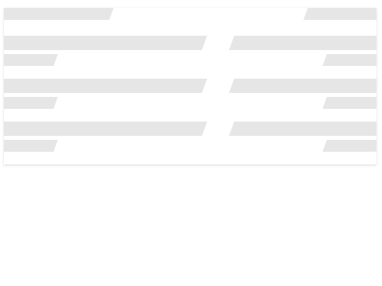

 

[Demo of component in Cells Catalog](https://au-bbva-ether-cellscatalogs.appspot.com/?view=demo#/component/cells-skeleton-custom)

`<cells-skeleton-custom>` Provides a custom skeleton. HTML structure is fixed from the call element, using the `item-mask` attr for the element that you like to paint.

If you need some special skeleton item, you only create and add to custom skeleton.

Example:

```html
<cells-skeleton-custom>
  <cells-skeleton-item-account></cells-skeleton-item-account>
</cells-skeleton-custom>
```

## Styling

The following custom properties and mixins are available for styling:

### Custom Properties
| Custom Property                    | Selector                         | CSS Property     | Value        |
| ---------------------------------- | -------------------------------- | ---------------- | ------------ |
| --cells-skeleton-custom-color-mask | :host ::slotted() [item-mask]    | background-color | --bbva-200   |
| --cells-skeleton-custom-color-bg   | .skeleton-content .animate-layer | background-color | --bbva-white |
### @apply
| Mixins                                | Selector                         | Value |
| ------------------------------------- | -------------------------------- | ----- |
| --cells-skeleton-custom               | :host                            | {}    |
| --cells-skeleton-custom-item-mask     | :host ::slotted() [item-mask]    | {}    |
| --cells-skeleton-custom-content       | .skeleton-content                | {}    |
| --cells-skeleton-custom-animate-layer | .skeleton-content .animate-layer | {}    |
| --cells-skeleton-custom-content-unbox | .skeleton-content.unbox          | {}    |
