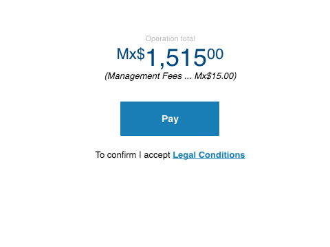

# cells-summary-view

[](http://bbva-files.s3.amazonaws.com/cells/bbva-catalog/index.html)

[Demo to component in Cells Catalog](http://bbva-files.s3.amazonaws.com/cells/bbva-catalog/index.html#/elements/cells-summary-view)

A confirmation showing the operation total amount and a 'finish' button. It also can display legal terms link with showLegalTerms property.
It can shows only the button if showAddition property is not setted.

Example:

```html
<cells-summary-view
    operation = "{
      id: '1497536068763',
      description: '123',
      totalFees: {
        amount: 15,
        currency: 'MXN'
      },
      fees: [
        {
          feeType: {
            id: 'MANAGEMENT_FEE',
            name: 'Management Fee'
          },
          feeAmount: {
            amount: 15,
            currency: 'MXN'
          }
        }
      ],
      status: {
        id: 'SETTLED',
        name: 'Settled'
      },
      amount: {
        amount: 1515,
        currency: 'MXN'
      }
    }"
    currency-code="EUR"
    local-currency="EUR"
    button-label="cells-summary-view-transfer"
    show-legal-terms
    show-addition>
</cells-summary-view>
```

## Styling

The following custom properties and mixins are available for styling:

| Custom property                                | Description                | Default                          |
|:-----------------------------------------------|:---------------------------|:--------------------------------:|
| --cells-summary-view-bg-color                  | background color for :host | var(--bbva-white, #fff)          |
| --cells-summary-view                           | empty mixin                | {}                               |
| --cells-summary-view-title-color               | color for title            | var(--bbva-400, #BDBDBD)         |
| --cells-summary-view-title                     | empty mixin                | {}                               |
| --cells-summary-view-container                 | empty mixin                | {}                               |
| --cells-summary-view-quantity-color            | color for quantity         | var(--bbva-core-blue, #004481)   |
| --cells-summary-view-quantity                  | empty mixin                | {}                               |
| --cells-summary-view-comission-color           | color for commision        | var(--bbva-600, #121212)         |
| --cells-summary-view-comission                 | empty mixin                | {}                               |
| --cells-summary-view-comission-last            | empty mixin                | {}                               |
| --cells-summary-view-legal-terms-color         | color for legal terms      | var(--bbva-600, #121212)         |
| --cells-summary-view-operations-total          | mixin applied at total     | {}                               |
| --cells-summary-view-legal-terms               | empty mixin                | {}                               |
| --cells-summary-view-submit-button             | empty mixin                | {}                               |
| --cells-summary-view-legal-terms-text-color    | color for legal terms text | var(--bbva-medium-blue, #2A86CA) |
| --cells-summary-view-legal-terms-text          | empty mixin                | {}                               |
| --cells-summary-view-skeleton-color            | skeleton color             | var(--bbva-200, #E9E9E9)         |
| --cells-summary-view-skeleton-background-color | skeleton background color  | var(--bbva-white, #FFF)          |
