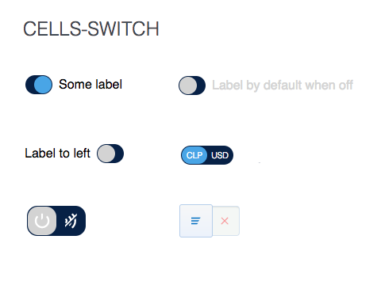

# cells-switch

[](http://bbva-files.s3.amazonaws.com/cells/bbva-catalog/index.html)

[Demo to component in Cells Catalog](http://bbva-files.s3.amazonaws.com/cells/bbva-catalog/index.html#/elements/cells-switch)

`<cells-switch>` is a control component that toggles between two statuses: __checked__ and __unchecked__.

It has three configurable icons: `iconCheck`, `iconUncheck`, `iconToggle`.

Use it with an static label only or with labels that change according to the `checked` status.

Basic example:

```html
<cells-switch></cells-switch>
```

Use `checked` property inherited from `Polymer.IronCheckedElementBehavior`, to give the status:

```html
<cells-switch checked></cells-switch>
```

Example with __static label__:

```html
<cells-switch>Some label</cells-switch>
```

Example __changing label__ according to `checked` status:

```html
<cells-switch
  label-on="Changed by toggle on">Label by default when off</cells-switch>
```

Example __with icons__:

```html
<cells-switch with-icons icon-size="16"
  icon-checked="coronita:nfcconnect"
  icon-unchecked="coronita:nfcdisconnect"
  icon-toggle="coronita:on"></cells-switch>
```

Use `checked-area`, `unchecked-area` or `toggles-area` attributes to override content of those areas:

```html
<cells-switch class="with-contents">
  <span unchecked-area>CLP</span>
  <span checked-area>USD</span>
</cells-switch>
```

## Icons

Since this component uses icons, it will need an [iconset](https://bbva.cellsjs.com/guides/best-practices/cells-icons.html) in your project as an [application level dependency](https://bbva.cellsjs.com/guides/advanced-guides/application-level-dependencies.html). In fact, this component uses an iconset in its demo.

## Styling

__Note__: use the custom CSS properties `--cells-switch-width` and `--cells-switch-knob-size` to set the switch and knob width respectively instead of setting it via mixin because they are used to calculate the transform value.

The following custom properties and mixins are available for styling:

| Custom property | Description     | Default        |
|:----------------|:----------------|:--------------:|
| --cells-switch  | Mixin applied to :host     | {}  |
| --cells-fontDefault  | Mixin applied to :host font-family    | sans-serif  |
| --cells-switch-knob-size  | Width and height of knob (Number)     | 22  |
| --cells-switch-width | Width of the switch (Number) | 32 |
| --cells-switch-label  | Mixin applied to label     | {}  |
| --cells-switch-switcher-bg-color  | Background color of switcher     | #072146  |
| --cells-switch-switcher  | Mixin applied to switcher     | {}  |
| --cells-switch-items  | Mixin applied to all items     | {}  |
| --cells-switch-icons  | Mixin applied to all items' icons     | {}  |
| --cells-switch-checked-color  | Color of checked item     | #fff  |
| --cells-switch-checked  | Mixin applied to checked item   | {}  |
| --cells-switch-checked-icon  | Mixin applied to checked item's icon   | {}  |
| --cells-switch-unchecked-color  | Color of unchecked item     | #fff  |
| --cells-switch-unchecked  | Mixin applied to unchecked item   | {}  |
| --cells-switch-unchecked-icon  | Mixin applied to unchecked item's icon   | {}  |
| --cells-switch-knob-color  | Color of knob   | #fff  |
| --cells-switch-knob-bg-color  | Background color of knob   | #D3D3D3  |
| --cells-switch-knob-checked-bg-color  | Background color of knob when checked  | #49A5E6  |
| --cells-switch-knob-checked  | Mixin applied to knob when checked  | {}  |
| --cells-switch-knob-icon  | Mixin applied to knob's icon  | {}  |
